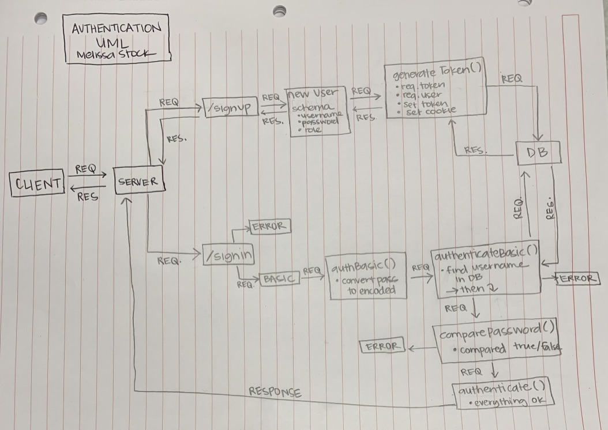

 LAB
=================================================

## Project Name

### Author: Student/Group Name

### Links and Resources
* [submission PR](https://github.com/401-advancedjs/authentication/pull/1)
* [travis](https://www.travis-ci.com/401-advancedjs/Authentication)

#### Documentation
* [api docs](http://xyz.com) (API servers)
* [jsdoc](http://xyz.com) (Server assignments)
* [styleguide](http://xyz.com) (React assignments)

### Modules
#### `middlware.js`
#### `router.js`
#### `users-model.js`
#### `404.js`
#### `error.js`
#### `books.js`
#### `middleware.js`
#### `app.js`

##### Exported Values and Methods

###### `foo(thing) -> string`
Usage Notes or examples

###### `bar(array) -> array`
Usage Notes or examples

### Setup
#### `.env` requirements
* `PORT` - Port Number
* `MONGODB_URI` - URL to the running mongo instance/db

#### Running the app
* `npm start`
* Endpoint: `/signup`
  * Returns a JSON object with a token in it representing the new account.
* Endpoint: `/signin`
  * Returns a JSON object with  in it.
* Endpoinrt: `books`
  * Returns a JSON object with the selected books in it.
  
#### Tests
* How do you run tests?
* What assertions were made?
* What assertions need to be / should be made?

#### UML
 
